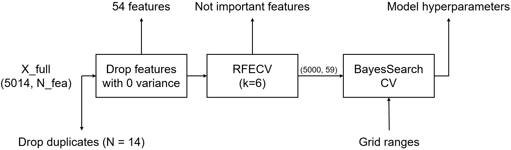

# MOFs: Machine learning for discovery of MOFs for gas separation applications

MOFs are a class of porous crystalline nanomaterial that show incredible promise for carbon capture applications. This is because their geometry (the shape of their pores) can be tuned for specific applications during synthesis. By selecting different combinations of metal nodes and organic linkers, MOFs can be customized to adsorb specific molecules (like CO₂) and let others pass through. While this is very exciting, it is difficult to find the ideal MOF for a task because of the size of the design space - there are a nearly infinite number of linker-metal combinations. This is why data-driven discovery techniques have become so popular in the MOF field.

Machine learning accelerates this discovery process by enabling the prediction of gas uptake properties from structural and chemical descriptors, reducing the need for time-consuming and costly experiments or simulations.

  

# Main Goals:
- Exploratory data analysis (EDA) to understand the meaningful features and descriptors of MOFs for predicting the CO2 uptake at low/high pressure.
- Predicting the CO2 uptake at low pressure is the main challenge

# Data:
- The dataset used in this project originates from the publication "Understanding the diversity of the metal-organic framework ecosystem", which explores the application of machine learning for predicting gas adsorption properties in MOFs. This dataset contains geometric and chemical descriptors, as well as simulated gas uptake values, enabling the development and evaluation of regression models for materials discovery.
- Number of data points: ~ 5,000
- Number of features: ~ 300
- As descriptors, I will use pore geometric descriptors, such as density, pore volume, etc., and revised autocorrelation functions (RACs) for describing the chemistry of MOFs. The dataset has four properties for MOFs:
  - CO2 uptake at 0.15 bar and 298K
  - CO2 uptake at 16 bar and 298K
  - CH4 uptake at 5.8 bar and 298K
  - CH4 uptake at 65 bar and 298K
- Examples for pore geometry descriptors (in - geometric_descriptors) to characterize include:
  - Di: size of the largest included sphere
  - Df: largest free sphere
  - Dif: largest included free sphere
  - Surface area (SA) of the pore
  - Probe-occupiable pore volume (POV).
 
RACs (in the lists starting with summed_...) operate on the structure graph and encode information about the metal center, linkers and the functional groups as differences or products of heuristics that are relevant for inorganic chemistry, such as electronegativity (X), connectivity (T), identity (I), covalent radii (S), and nuclear charge (Z).

  

# Model of Choice:
XGBoost
Why?
- I traditionally used XGBoost for any tabular data. So it was an arbitrary choice
- Very good for chemical tabular data
-   It has high accuracy, but is limited such that it overfits easily.
-       usually due to tree depth... so we should be worry about this

### Step 1
Initial train.csv → 80/20 split

Baseline val score (R2) - untuned model, all features = 0.67 to 0.68

### Pipeline

  

# Curse of Dimensionality
There are ~300 features, with N = 5,000 data points
- Rule of thumb: usually minimum number of datapoints is 10 x number of features to 20 x number of features
  - Not established in literature... Just a rule I saw on Data Science. Stack Exchange :)
- Used RFECV (k=6) → ended with 59 features
  - Very expensive process... But N = 5,000 is relatively small
  - Why RFECV? Complex property, cannot just use simple filter - use wrapper
- Most features are RACs, some are geometric (Di, Df, Dif, density, ...)
- Makes sense for LP uptake
  - RACs are going to be more important due to chemistry information
  - Geometric descriptors are not as important (more important for HP), but pore shape and surface area can be important!
  - Density is also expected to be somewhat inversely proportional to LP uptake

# BayesSearchCV
- Why BayesSearchCV?
  - Uses BO to approach the maxima (in this case, negative MAE)
  - Less expensive than grid search
- Grid established:
  - Learning_rate: [0.01, 1.0]
  - Max_depth: [3, 10]
  - N_estimators: held constant at 600
  - Subsample: [0.1, 1.0]
  - Reg_lambda: log-uniform [1e-6, 1000]
  - Reg_alpha: log-uniform [1e-6, 1000]
- Objective function: Negative MAE
- Optimizer: Gaussian Process (GP)
- For faster hyperparameter tuning, a random subset of training data (40%) was used
